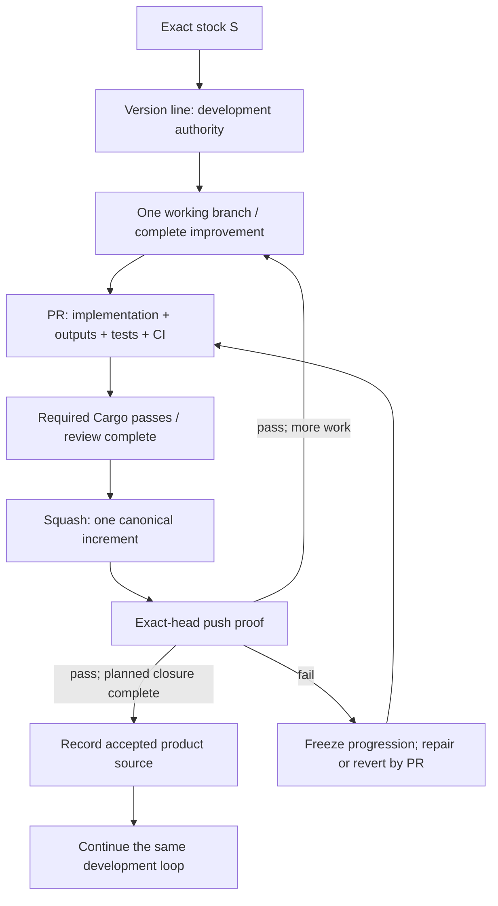

# Version-line-first development

> A new Grok version should be born the same way good software is built: one
> complete, tested, understandable improvement at a time, directly on the line
> that will live with it.

This is the canonical current Grok development policy. The filename remains for
existing entrypoints. Carry-forward is the initial series of ordinary development
PRs on new stock, not a separate promotion system.

## Authorities and terms

| Term | Meaning |
| --- | --- |
| Exact stock `S` | Pinned upstream `rust-vX.Y.Z` commit; authority for target architecture, stock behavior, generators, and repository-native tests. |
| `grok/main` | Current process documentation plus optional active experiments on practical upstream main; not the accepted product baseline. |
| Version line `grok/rust-vX.Y.Z` | The durable branch on which that generation is developed. It owns canonical development history from exact-stock bootstrap. |
| Accepted product source | An exact version-line revision whose planned product and development-process closure have been reviewed and accepted. |
| Working branch | Disposable branch for one PR, including test-first experiments and fixups. |

During initialization the new line is development authority, not yet the next
accepted product baseline. The previous explicitly accepted line remains that
baseline. Neither branch naming, branch creation, CI success alone, nor an
artifact grants product acceptance.

There is no normal `carry/` branch, long-lived RC source branch, final bulk
promotion, or special fast-forward admission service. Old carry/RC branches may
remain frozen as historical evidence. A candidate is identified by a PR or SHA.

## Before the first increment

Pin the previous accepted product reference and exact target stock. Read only
the behavior, owner seams, native proof, and development capabilities needed for
continuation. Prior implementations may be read and locally reused, but must be
adapted and proved at current stock seams; do not transplant a final tree and
call its old CI proof current.

For each relevant behavior or capability choose `KEEP`, `UPDATE`, or `DROP`, with
rationale and an owner. Use stock when it now owns the behavior. Separate product
changes from representation cleanup. A verified baseline rewrite may aid reading,
but does not replace exact stock as the new branch's root.

Plan independently meaningful increments by real dependencies. An owner is not
necessarily one commit: split or combine only when each resulting increment is
complete and independently testable. Tests, CI, Facts/Live harnesses, review, and
optional delivery capability are development assets, not terminal cleanup.

The first PR, conventionally C0, records a small version-specific contract under
`grok/docs/`: pinned inputs, decisions, dependencies, intended increments, their
minimum proof, and evidence/delivery roles. It also establishes native baseline
CI. This is a plan, not an executable stage manifest or CI-results ledger. Results
and current scheduling stay in GitHub. Update the contract when new evidence
changes a boundary; never silently reduce an acceptance criterion.

## Start the line safely

Create the version line at exactly `S`, not at an unreviewed Grok snapshot.
Read back the ref. Configure native protections before product work: PR-required
updates, strict required `Cargo`, squash-only admission for the line, and no
ordinary bypass, force-push, or deletion. Verify the first PR can supply the
required workflow; do not waive `Cargo` if bootstrap fails.

Bootstrap is a narrowly authorized administrative operation. Native rules must
restrict who may create protected lines where available; the operator verifies
the exact-stock starting SHA. A documented procedure is not proof that a rule
has been configured. Inspect the actual rules and account permissions.

For a mistaken existing line, preserve and verify archive refs before any
explicitly authorized reset. Limit a temporary protection exception to the named
line and operation, restore protections immediately, and verify the result.
Do not weaken historical accepted lines. This is corrective migration, not a
routine development step or authorization granted by these documents.

## One development loop

1. Branch from the current version-line HEAD after its required post-merge proof
   is green; exact stock is the initial exception before C0 establishes CI.
2. Develop one understandable improvement. Test-first RED, fixups, and refactoring
   belong on the working branch, not canonical history.
3. Close the changed owner: implementation, owned derived outputs, native tests,
   relevant deterministic harness pieces, and required CI activation together.
4. Open a PR to the version line. Review behavior and stock compatibility; require
   the accumulated native proof and the current base required by protection.
5. Squash the reviewed PR into one canonical development commit.
6. Run the same native proof on that actual post-merge SHA. Do not advance to the
   next feature increment until it succeeds.

A good increment is a state another engineer can safely take over, not merely a
commit with a green icon. Keep previous proof obligations active; replace a test
only when stock ownership or an explicit semantic decision justifies equivalent
or stronger coverage. Source greps, empty test selections, skipped required
jobs, and disabled assertions are not semantic proof.

PR proof and exact-head proof have different subjects; a squash SHA need not
match the working SHA. The canonical squash commits are the development history
we retain. Do not demand preservation of scratch commit SHAs.

Green prefixes are an enforced objective, not a promise that infrastructure or
tests can never fail. If a canonical head fails, report the actual failure and
stop feature progression. Triage an infrastructure failure or submit a minimal
repair/revert PR. Do not erase accepted history or claim every historical prefix
passed when it did not.

## Native CI, without a second test framework

Use one local reusable workflow, `.github/workflows/grok-proof.yml`, with
`workflow_call`. Keep native test/lint/generator invocations directly visible;
follow the pinned stock's repository instructions and established test entrypoints.
Do not add a Grok proof runner or output interpreter.

The thin `.github/workflows/grok.yml` calls that same-revision workflow for both
PR and push events on version lines. `Cargo` is the stable required PR aggregate.
The push invocation proves the actual canonical SHA. All required proof jobs must
succeed; missing, cancelled, skipped, or empty proof is not a pass. A small native
job-result aggregate is orchestration, not a semantic test implementation.

C0 contains only applicable stock baseline proof. Each later PR adds its own
native proof to the shared workflow, permanently joining the accumulated set.
There is no owner-marker detection, owner/stage manifest, progressive/full mode,
or separate carry caller. Final composition grows there too; it is not invented
at a later admission boundary. PR and push use the same deterministic contract,
although their tested commit context differs.

Do not cancel a canonical head's proof to hide it behind a newer push. Scheduling
can supersede outdated working-PR runs, but it must preserve exact-head evidence.
Stock-owned generators and consistency tests close only the affected owner;
do not add a global generated-file audit.

## Process capability and product acceptance

Harness mechanics and scenario source grow with their semantic owners. Carry
common harness support only when first used, with deterministic tests. Do not
make early Provider proof depend on a product catalog introduced by a later PR.
Provider-neutral fixes do not need invented Facts or Live scenarios for symmetry.

A final process-integration increment may wire backend Facts, distribution,
manual diagnostic Live, and artifact-to-Live orchestration. It may add tests for
those new process mechanisms, but may not become a dumping ground for semantic
proof or owned outputs omitted from earlier owners.

Record `RECONSTRUCTED` only when product closure and process closure are both
supported: selected owners and derived outputs are current; accumulated native
and composition proof passed; and normal review, testing, Facts/Live invocation,
and selected delivery capability exist or have explicit scoped decisions.
An `UPDATE` label alone does not close a missing selected capability.

Then record review acceptance against the actual green canonical SHA in the
owning GitHub roadmap/PR. This is not another branch promotion or release state
machine. Do not accept an incomplete line as the next product baseline merely
because some prefixes passed. After acceptance, normal fixes use the same loop.

## Evidence boundaries

| Evidence | What it establishes | What it does not establish |
| --- | --- | --- |
| Native tests, lint, consistency, harness unit tests | Observed deterministic owner behavior and integration for the tested revision. | Exhaustive correctness, current backend behavior, or product acceptance by itself. |
| Facts | Recorded backend observations, with freshness and environment. | Product policy or catalog authority. |
| Real-provider Live | Observed end-to-end runtime behavior for the selected subject. | Native coverage or source acceptance by itself. |
| Artifact smoke | Usability of the actual package tested. | Product/source authority. |

Live/Facts execution is parallel and non-blocking for initialization acceptance
unless an explicit product decision makes a particular claim require fresh
backend evidence. Historical, not-rerun, and unknown claims stay labeled. A
concrete discovered defect still needs triage; "non-blocking evidence" is not
permission to ignore a demonstrated correctness or security problem.

Capability availability and execution are different. Preserve the selected
Facts/Live and delivery mechanisms; do not pretend they ran. Distribution is
optional and governed by [distribution.md](./distribution.md).

## Execution, scope, and maintenance

When progress genuinely waits on CI, identify one exact wait object: repository,
run/attempt, HEAD and PR context if relevant, authoritative status source,
settlement condition, and the action to resume. Pause immediately. Grok Bot
monitors and notifies; the coordinating assistant neither polls nor creates a
ChatGPT watcher. Missing permission or an unavailable entrypoint is a different
external blocker and must be named honestly.

Issue maps coordinate outcomes and real dependencies; they do not replace tests
or create another authority. Fix the owning issue rather than duplicating it.
Separate technical dependencies from a chosen serial landing order.

Keep `grok/main` a small process overlay on practical `openai/codex main`, with
only useful active experiments. Updating it does not reset version lines or
carry experiments into the product. Rebase/prune/history mutation requires its
own authorization. Preserve the overlay and classify any discarded work.

Historical release/carry documents explain old operations; they do not override
current policy. Preserve lessons, not accidental mechanisms. Do not add proof
ledgers, source-promotion bots, workflow-state models, or post-hoc PR provenance
reconstruction. Review through [review.md](./review.md), and remove duplicated
policy once repository structure and native controls express it.
